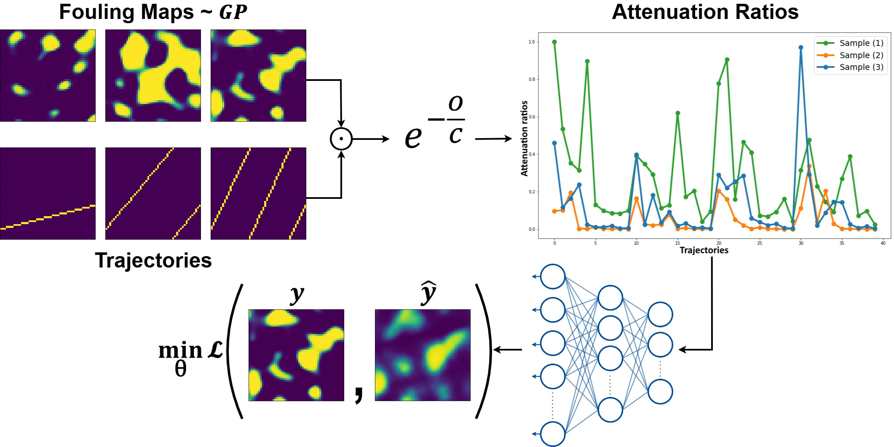
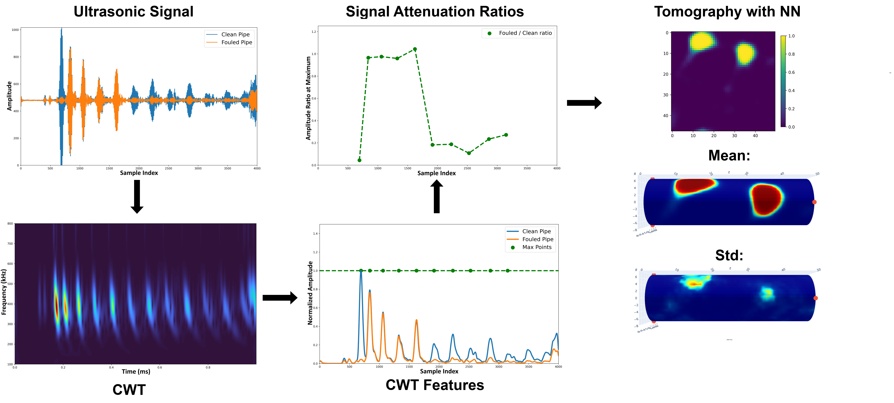

# [ACM TOPML] Physical Simulator-Based Neural Networks for Real-Time Fouling Tomography
This repository implements our fouling localization method.

## Introduction
We proposed a method for real-time estimation of fouling distribution inside a closed metal structure (pipeline) by analysing the changes in ultrasonic waves caused by the fouled area on the structure's surface. For this aim, we built an amortized inference method using neural networks. Our network is trained solely on synthetic data, however tested on empirical data acquired from laboratory setting. 

## Data
For synthetic data generation, go to the `simulate_data` folder. `create_B_Dx_Dy.py` generates the ultrasonic trajectory matrices to compute integral observations between fouling maps and trajectories, and distance matrices to be used in the kernel function for fouling map generation. `create_maps.py` generates **fouling maps** from a Gaussian process (GP) prior. `create_ratios.py` computes **attenuation ratios** using integral observations (also defined as overlaps). 

## Experiments
For neural network training, go to `nn_training` folder. Generated synthetic data (**fouling maps** and **attenuation ratios**) should be in `dataset` folder. Model training and testing can be done using `train_model.py` and `test_model.py`.

For direct GP inversion and amortized uncertainty estimation, go to `stan_code` folder and `uncertainty_estimate` folder. `gp_inversion.py` can be used for direct GP inversion implemented via `stan`. This code will save `mean_fouling_maps.npy` and `std_fouling_maps.npy`, estimated standard deviations can be used to train the neural network for amortized uncertainty estimation. `uq_training.py` can be used to train the network, and `test_uq_model.py` can be used for testing the model. `uq_plot.py` is for computing the joint log-likelihood across different training sizes.

## Empirical data evaluation
For empirical data evaluation, see `empirical_data_evaluation` folder. `fouling_localization.py` will require measurement files from a clean and a fouled pipe to extract **attenuation ratios**, and estimate fouling distribution using our amortized network. For empirical data acquisition, please contact to [Electronics Research Laboratory](https://electronics.physics.helsinki.fi).

## Requirements
<pre>
This project uses the following Python packages:
- numpy
- pandas
- scipy
- torch
- matplotlib
- plotly
- stan
- nest_asyncio
</pre>

## Folder Structure
<pre>
.
└── empirical_data_evaluation/
    ├── data/
    │   └── model_name.pth 
    │   └── clean_pipe_measurement.tsv <ins>(will be available upon request)</ins>  
    │   └── fouled_pipe_measurement.tsv <ins>(will be available upon request)</ins>          
    ├── outputs/
    ├── define_model.py
    ├── fouling_localization.py

└── nn_training/
    ├── dataset/
    ├── training_output/
    │    ├── models/
    │    └── results/
    ├── define_model.py
    ├── test_model.py
    ├── train_model.py
    ├── utility.py

└── simulate_data/
    ├── B_Dx_Dy/
    ├── dataset/
    ├── create_B_Dx_Dy.py
    ├── create_maps.py
    ├── create_ratios.py
    ├── tool.py
    ├── utility.py

└── stan_code/
    ├── dataset/
    ├── results/
    ├── gp_inversion.py

└── uncertainty_estimate/
    ├── dataset/
    ├── training_output/
    │    ├── models/
    │    └── results/
    ├── define_model.py
    ├── test_uq_model.py
    ├── uq_plot.py
    ├── uq_training.py
</pre>

## Citation
<pre>
Here will be updated upon publication.  
</pre>
